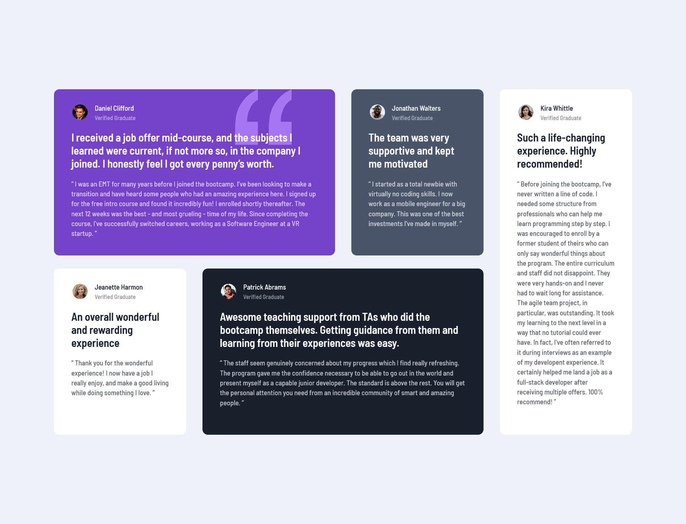

# Frontend Mentor - Testimonials grid section solution

This is a solution to the [Testimonials grid section challenge on Frontend Mentor](https://www.frontendmentor.io/challenges/testimonials-grid-section-Nnw6J7Un7). Frontend Mentor challenges help you improve your coding skills by building realistic projects. 

## Table of contents

- [Overview](#overview)
  - [The challenge](#the-challenge)
  - [Screenshot](#screenshot)
  - [Links](#links)
- [My process](#my-process)
  - [Built with](#built-with)
  - [What I learned](#what-i-learned)
  - [Useful resources](#useful-resources)
- [Author](#author)

## Overview

### The challenge

Users should be able to:

- View the optimal layout for the component depending on their device's screen size

### Screenshot

### Links

- Solution URL: [github.com/nathanieladiah/testimonials-grid](https://github.com/nathanieladiah/testimonials-grid)
- Live Site URL: [nathanieladiah.github.io/testimonials-grid](https://nathanieladiah.github.io/testimonials-grid)

## My process

### Built with

- Semantic HTML5 markup
- CSS custom properties
- SCSS
- Flexbox
- CSS Grid
- Mobile-first workflow

### What I learned

### Useful resources

- [CSS-Tricks: A Complete Guide to Grid](https://css-tricks.com/snippets/css/complete-guide-grid/) - 
This is a great resource for seeing all the CSS grid properties and options visually.

## Author

- Website - [Nathaniel Adiah](https://nathanieladiah.github.io)
- Frontend Mentor - [@nathanieladiah](https://www.frontendmentor.io/profile/nathanieladiah)
- Twitter - [@nathanieladiah](https://www.twitter.com/nathanieladiah)
